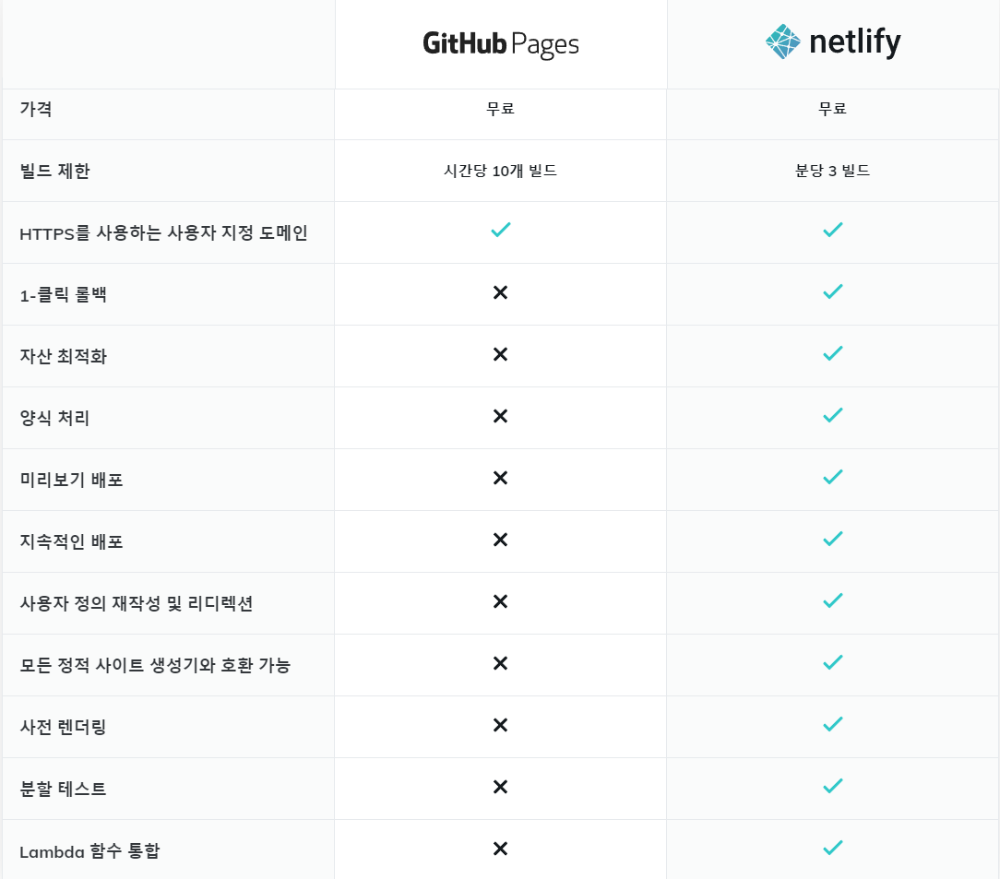

# Vue CLI를 이용한 DevOps 개발환경 실습

## TIL

DevOps : https://www.netapp.com/ko/devops-solutions/what-is-devops/


(출처 : AWS)


사전 환경 구성 및 Vue 생성

- 기본적인 명령어 구성은 이미 1학기에 배운 내용이었으나, Vue 기본 설정에서 Vue 2를 사용하는 것이 아닌, Manually select features를 선택하여 설정을 변경하는 것을 배웠다(*3)

- Unit Testing :  단위 테스트로 Jest를 이용한다. 상태, 메소드 , 컴포넌트 등의 기능들이 정상 동작하는지 확인하는것을 의미한다.

- Jest : 페이스북에서 만든 테스트 프레임워크로 Unit Testing을 위한 테스트 러너이다.

- Prettier : 이름에서 알 수 있듯이 코드 스타일을 정리해주는 도구이다(저장 버튼을 눌렀을 때 자동으로 코드를 정리해줌). ESLint와 함께 사용할 수 있다.(VSCode에서는 확장 플러그인 (Prettier - Code formatter)를 설치할 수 있다.)

  - settings.json 파일에 아래와 같이 추가하면 적용된다.

  ```
  {
   "editor.formatOnSave": true,
   "editor.formatOnType": true,
  }
  ```

  

- ESLint : 잘못된 코드 스타일로 인해 에러가 나지 않게 코드 문법을 검사한다.

- Vue 프로젝트에서 3 버전은 ESLint 와 Prettier를 지원한다.

> 출처 : https://joshua1988.github.io/web-development/vuejs/boost-productivity/


자동배포와 수동 배포

- 수동 

  - github에 repository 를 만들어 project 파일을 푸시함
  - github pages로 배포하기 위한 라이브러리 설치 (*gh == github)

  ```
  $yarn add gh-pages -D
  ```

  - package.json에 다음과 같은 코드를 추가한다.

  ```
  "name": "vue-devops",
    "version": "0.1.0",
    "private": true,
    "homepage": "https://ssong_14.github.io/vue-devops",
    "scripts": {
      "serve": "vue-cli-service serve",
      "build": "vue-cli-service build",
      "predeploy": "vue-cli-service build",
      //npm run build
      "deploy": "gh-pages -d dist",
      "clean": "gh-pages-clean",
      "test:unit": "vue-cli-service test:unit",
      "lint": "vue-cli-service lint"
    },
  ```

  - 배포용 publicPath를 설정해야하는데 프로젝트의 최상위 폴더 내부에 vue.config.js 파일을 생성한다.
  - 이 파일은 자동으로 @vue/cli-service를 로드한다.
  - publicPath의 이름은 repository 이름으로 설정한다.
  - 공식문서에서는 CLI 3이후로는 publicPath를 사용하는 것을 권장한다.
  - run build와 마찬가지인 명령어 yarn deploy를 사용한다.

- 자동(GitHub Actions workflow)

  - actions에서 workflow 설정 > deploy.yml 파일 생성
  - pull 후 다음과 같은 코드 추가

  ```
  jobs:
    deploy:
      runs-on: ubuntu-latest
  
      steps:
      - name: Checkout source code
        uses: actions/checkout@master
  
      - name: Set up Node.js
        uses: actions/setup-node@master
        with:
          node-version: 14.x
  
      - name: Install dependencies
        run: yarn install
        
      - name: Test unit
        run: yarn test:unit
  
      - name: Build page
        run: yarn build
        env:
          NODE_ENV: production
  
      - name: Deploy to gh-pages
        uses: peaceiris/actions-gh-pages@v3
        with:
          github_token: ${{ secrets.GITHUB_TOKEN }}
          publish_dir: ./dist
  
  
  ```

  - 여기서 문제가 들여쓰기 오류나면 deploy를 안해준다... 물론 에러를 다 잡아주긴 하지만 이건 좀 너무하다는 생각이...그렇다
  - 야믈파일이 xml이나 json과 같은 포맷에 비하면 가독성이 높고 편리하다는 의견이 다수인데 실제로 훨씬 가시적이다.


#### 테스트 결과


### 소감 :

github으로 commit으로만 deploy를 진행할 수 있다는 점에서 보다 완성도 높은 프로젝트를 개발할 수 있는 기능을 배우게 되었다.

이 기능은 매우 유용하고 간편한 방법이라 할 수 있겠다지만....

1. netlify는 다수의 도메인을 쓸수 있는데 github page는 단일 도메인밖에 못쓴다.

   




​		 
